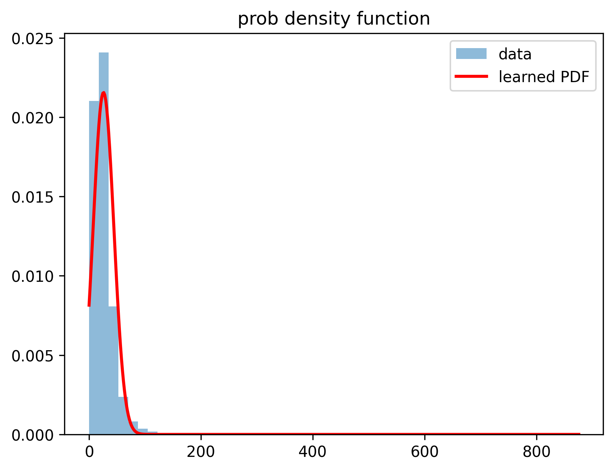

# Learn Probability Density Functions using Roll-Number-Parameterized Non-Linear Model

## Author : Saumya Kumari
## Roll no: 102303161

---

## Objective

The objective of this assignment is to learn the parameters of a probability density function (PDF) after applying a roll number based non-linear transformation on real world air quality data.

The feature considered for this study is **NO₂ (Nitrogen Dioxide)** concentration.

The goal is to:
- Apply a custom non-linear transformation using roll number
- Estimate parameters of the probability density function
- Visualize the learned distribution
- Understand statistical parameter estimation

---

##  Dataset

Dataset Used:  
India Air Quality Data (Kaggle)

🔗 Link:  
https://www.kaggle.com/datasets/shrutibhargava94/india-air-quality-data

Feature Used:
- **no2**

---

## 🔢 Roll Number Based Transformation

Roll Number: **102303161**

The transformation applied is:

z = x + aᵣ sin(bᵣ x)

Where:

aᵣ = 0.05 × (r mod 7)  
bᵣ = 0.3 × ((r mod 5) + 1)

For roll number 102303161:

r mod 7 = 2  
r mod 5 = 1  

Therefore:

aᵣ = 0.10  
bᵣ = 0.6  

Final transformation:

z = x + 0.10 sin(0.6x)

---

## Methodology

1. Extract NO₂ values from dataset.
2. Apply roll-number-based non-linear transformation.
3. Assume Gaussian-like probability density model:

   p̂(z) = c · exp(-λ (z - μ)²)

4. Estimate parameters analytically:

   μ = mean(z)  
   λ = 1 / (2σ²)  
   c = √(λ / π)

5. Plot learned PDF over histogram of transformed data.

---

## 📈 Results

Estimated Parameters:

- Lambda (λ): **0.001460523735809626**
- Mu (μ): **25.810838442217115**
- c: **0.021561519986176458**

These parameters generate a smooth Gaussian-shaped probability density function that closely fits the transformed data distribution.

---

## Learned Probability Density Function

Below is the learned PDF plotted over the transformed data:

---

## Conclusion

This assignment demonstrates:

- The impact of non-linear transformations on data distribution.
- How roll-number-based parameterization personalizes models.
- Estimation of probability density parameters using statistical principles.
- Visualization and validation of learned distributions.

The transformed NO₂ data follows a Gaussian-like distribution, and the estimated parameters accurately model the probability density function.

